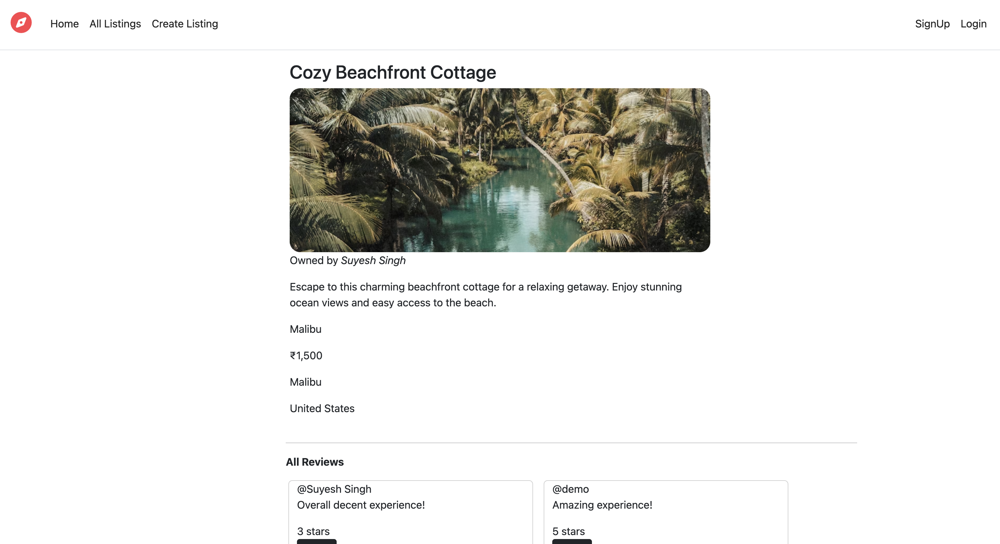
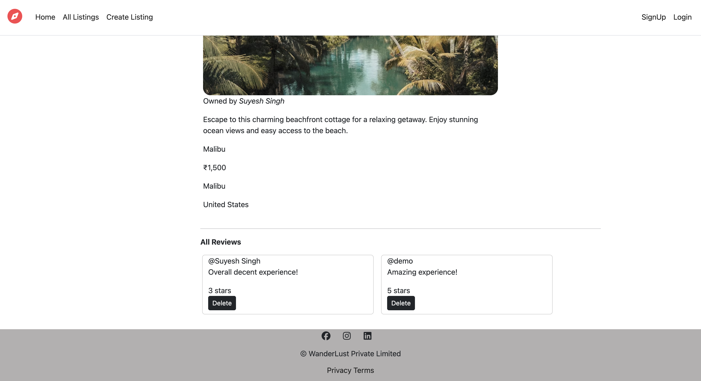
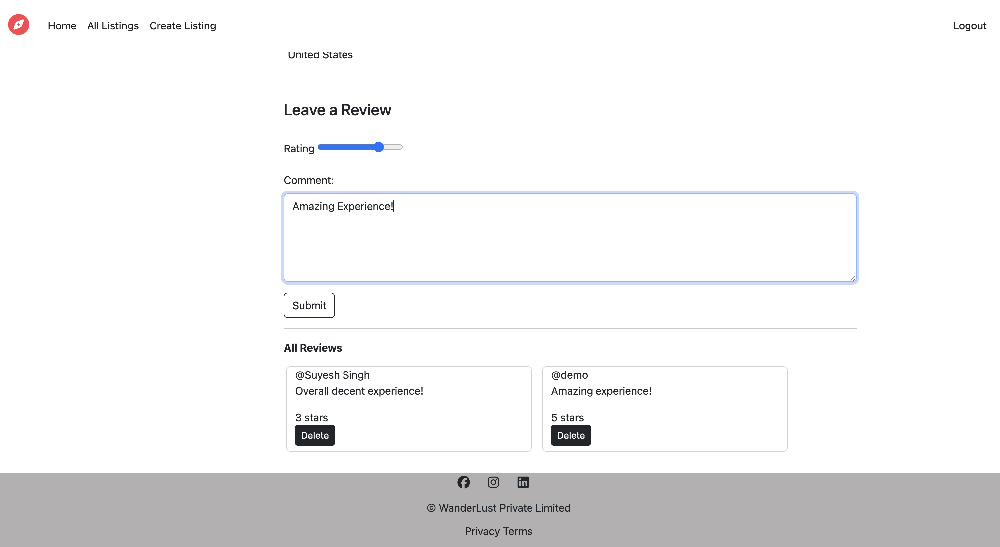
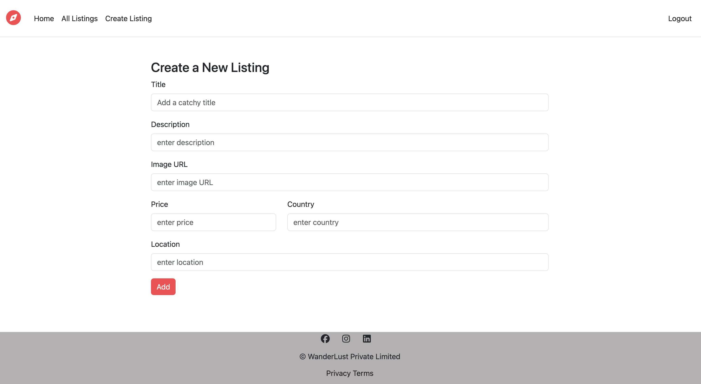
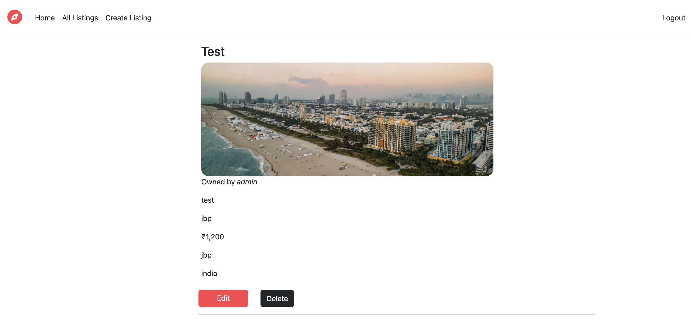
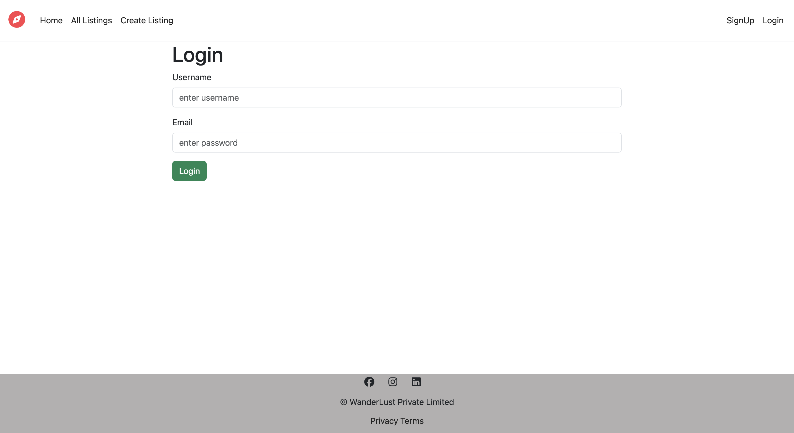
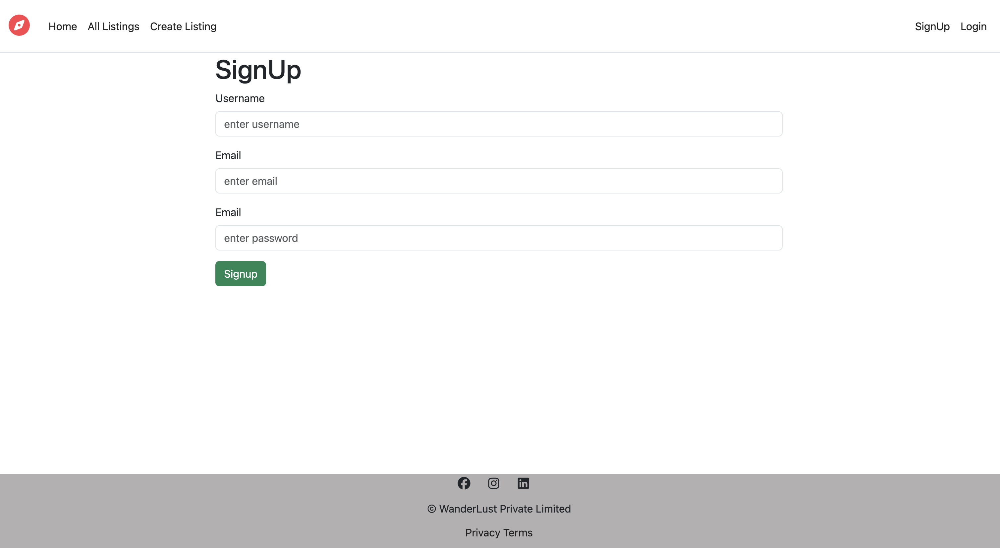

<div align="center">

# 🌍 WanderLust

### A full-stack Airbnb-inspired travel listing platform

[](https://nodejs.org/)
[](https://expressjs.com/)
[](https://www.mongodb.com/)
[](https://getbootstrap.com/)
[](LICENSE)

> Discover, create, and review travel accommodations worldwide — built with the MEN stack, Passport.js authentication, Joi validation, and EJS templating. No frontend framework required.


</div>

---

## 📌 Table of Contents

- [Overview](#-overview)
- [Screenshots](#-screenshots)
- [Features](#-features)
- [Tech Stack](#-tech-stack)
- [Architecture & Design Patterns](#️-architecture--design-patterns)
- [Security](#-security)
- [Project Structure](#-project-structure)
- [Getting Started](#-getting-started)
- [Environment Variables](#-environment-variables)
- [Database Seeding](#-database-seeding)
- [API Routes](#-api-routes)
- [Known Issues & Roadmap](#️-known-issues--roadmap)
- [Author](#-author)

---

## 🧭 Overview

**WanderLust** is a production-grade, full-stack web application that lets users browse, create, and review travel property listings — inspired by Airbnb. It demonstrates end-to-end implementation of:

- User authentication & persistent sessions
- Role-based authorization (owners vs. regular users)
- RESTful routing conventions
- Server-side schema validation with Joi
- Cascade deletes via Mongoose middleware
- Dynamic HTML templating without any frontend framework

Built entirely with server-rendered EJS views, this project is a clean example of what you can accomplish with the **MEN stack** (MongoDB, Express, Node.js) alone.

---

## 📸 Screenshots

| Page | Preview |
|---|---|
| All Listings |  |
| Listing Detail |  |
| Reviews Section |  |
| Leave a Review (logged in) |  |
| Create Listing |  |
| Owner View (Edit / Delete) |  |
| Login |  |
| Signup |  |
| Logged-in Homepage |  |

---

## ✨ Features

### 🔐 Authentication & Session Management

- Signup / Login / Logout powered by **Passport.js Local Strategy** with `passport-local-mongoose`
- Persistent login sessions via **express-session** with `httpOnly` cookies (7-day expiry)
- Flash messages via `connect-flash` for contextual success/failure feedback
- Post-login redirect to the originally requested URL (saved via `req.session.redirectUrl`)

### 🏠 Listing CRUD

- Full **Create / Read / Update / Delete** for property listings
- Listing fields: title, description, image URL (with fallback default), price, location, and country
- **Authorization enforced** — only the listing owner can edit or delete their own listing
- Image field uses a Mongoose `set` transformer — empty submissions silently fall back to a default image URL
- `method-override` middleware enables `PUT` and `DELETE` from standard HTML forms

### ⭐ Review System

- Authenticated users can leave a **star rating (1–5)** and a comment on any listing
- **Author-level authorization** — only the review's author can delete it
- Reviews are **cascade-deleted** when their parent listing is removed, implemented via a Mongoose `post('findOneAndDelete')` middleware hook on the Listing model

### 🔒 Route-Level Authorization

| Action | Middleware Applied |
|---|---|
| View listings | Public — no auth required |
| Create listing | `isLoggedIn` |
| Edit / Delete listing | `isLoggedIn` + `isOwner` |
| Create review | `isLoggedIn` + `validateReview` |
| Delete review | `isLoggedIn` + `isReviewAuthor` |

### 🛡️ Server-Side Validation with Joi

- All incoming request bodies for listings and reviews are validated **before** hitting the database
- Custom `validateListing` and `validateReview` middleware wrap **Joi schemas** defined in `schema.js`
- Malformed or missing fields throw a structured `ExpressError` (status `400`) before any DB operation

---

## 🧰 Tech Stack

| Layer | Technology |
|---|---|
| **Runtime** | Node.js v18+ |
| **Web Framework** | Express.js |
| **Database** | MongoDB |
| **ODM** | Mongoose |
| **Templating Engine** | EJS + ejs-mate (layout engine) |
| **Authentication** | Passport.js + passport-local + passport-local-mongoose |
| **Session Management** | express-session + connect-flash |
| **Validation** | Joi |
| **Form Method Override** | method-override |
| **Environment Config** | dotenv |
| **Styling** | Bootstrap 5 + custom CSS |
| **Language Split** | JavaScript (54.4%) · EJS (42.4%) · CSS (3.2%) |

---

## 🏗️ Architecture & Design Patterns

### MVC-Inspired Structure

The application follows a clean separation of concerns:

- **Models** (`/models`) — Mongoose schemas with embedded business logic (cascade deletes, field transformers, plugin hooks)
- **Routes** (`/routes`) — Express Router modules for `listings`, `reviews`, and `users`, each mounted at their own path prefix
- **Views** (`/views`) — EJS templates using `ejs-mate` for a shared layout shell (`boilerplate.ejs`)
- **Middleware** (`middleware.js`) — Reusable auth guards (`isLoggedIn`, `isOwner`, `isReviewAuthor`) and Joi validators (`validateListing`, `validateReview`)

### Async Error Handling via `wrapAsync`

All async route handlers are wrapped with a custom utility that forwards any rejection directly to Express's global error handler — eliminating repetitive `try/catch` blocks across every route:

```js
// utils/wrapAsync.js
module.exports = (fn) => (req, res, next) => fn(req, res, next).catch(next);
```

### Centralized Error Handling

A custom `ExpressError` class (`utils/ExpressError.js`) standardizes error shape (`status` + `message`) across the entire app. Unhandled routes fall through to a 404 handler; a single global middleware renders the `error.ejs` page.

### EJS-Mate Layout System

`ejs-mate` enables a single `boilerplate.ejs` layout that provides the shared navbar, footer, and flash message rendering. Every page template simply declares its content block — no duplication of HTML boilerplate.

### Mongoose Middleware for Cascade Deletes

The `Listing` model registers a `post('findOneAndDelete')` hook that automatically removes all reviews associated with a deleted listing, keeping the database in a consistent state without manual cleanup in route handlers.

---

## 🔐 Security

| Concern | Implementation |
|---|---|
| Hardcoded secrets | Moved to `.env` via `dotenv` |
| Session secret | Read from `process.env.SESSION_SECRET` |
| MongoDB connection string | Read from `process.env.MONGO_URL` |
| Cookie hardening | `httpOnly: true` on session cookie |
| Password storage | `passport-local-mongoose` uses `pbkdf2` hashing — passwords are never stored in plain text |
| Input validation | Joi validates all user input server-side before any DB operation |
| Authorization bypass | Owner/author checks enforced in dedicated middleware before any mutation route |
| Secret exposure | `.gitignore` excludes `.env`; `.env.example` ships as a safe reference |

---

## 📁 Project Structure

```
WanderLust/
├── app.js                    # Entry point — Express app setup, middleware pipeline, route mounting
├── middleware.js             # Auth guards (isLoggedIn, isOwner, isReviewAuthor) + Joi validators
├── schema.js                 # Joi validation schemas for Listing and Review
│
├── models/
│   ├── listing.js            # Listing schema — owner ref, reviews array, cascade delete hook
│   ├── review.js             # Review schema — rating, comment, author ref
│   └── user.js               # User schema — passport-local-mongoose plugin
│
├── routes/
│   ├── listing.js            # RESTful routes: GET /listings, POST, GET /:id, PUT, DELETE
│   ├── review.js             # POST /listings/:id/reviews, DELETE /:reviewId
│   └── user.js               # GET/POST /signup, GET/POST /login, GET /logout
│
├── utils/
│   ├── wrapAsync.js          # Async error forwarding wrapper
│   └── ExpressError.js       # Custom error class (status + message)
│
├── views/
│   ├── layouts/
│   │   └── boilerplate.ejs   # Shared HTML shell (navbar, footer, flash messages)
│   ├── listings/
│   │   ├── index.ejs         # All listings grid
│   │   ├── show.ejs          # Single listing detail + reviews + review form
│   │   ├── new.ejs           # Create listing form
│   │   └── edit.ejs          # Edit listing form
│   ├── users/
│   │   ├── signup.ejs        # Signup form
│   │   └── login.ejs         # Login form
│   └── error.ejs             # Global error page
│
├── public/
│   ├── css/                  # Custom stylesheets
│   └── js/                   # Client-side scripts
│
├── init/
│   ├── data.js               # Seed data — 12 sample listings
│   └── index.js              # DB seeder script
│
├── screenshots/              # UI screenshots for documentation
│
├── .env                      # ⚠️ Local secrets — NOT committed to Git
├── .env.example              # ✅ Safe template committed to Git
├── .gitignore                # Excludes node_modules, .env, OS files
└── package.json
```

---

## 🚀 Getting Started

### Prerequisites

- **Node.js** v18 or higher
- **MongoDB** running locally (`mongod`) or a MongoDB Atlas cluster

### Installation

```bash
# 1. Clone the repository
git clone https://github.com/Suyash066/WanderLust.git
cd WanderLust/Wanderlust

# 2. Install dependencies
npm install

# 3. Set up environment variables
cp .env.example .env
# Open .env and fill in your MONGO_URL and SESSION_SECRET

# 4. (Optional) Seed the database with sample listings
node init/index.js

# 5. Start the server
node app.js

# Or with auto-restart on file changes:
npx nodemon app.js
```

Visit **[http://localhost:8080/listings](http://localhost:8080/listings)**

---

## 🔑 Environment Variables

Create a `.env` file in the project root (use `.env.example` as a template):

```env
PORT=8080
MONGO_URL=mongodb://127.0.0.1:27017/wanderlust
SESSION_SECRET=your_strong_random_secret_here
```

**For production with MongoDB Atlas:**

```env
MONGO_URL=mongodb+srv://<user>:<password>@cluster0.xxxxx.mongodb.net/wanderlust?retryWrites=true&w=majority
SESSION_SECRET=<64-character-random-hex-string>
```

Generate a secure secret with Node.js:

```bash
node -e "console.log(require('crypto').randomBytes(32).toString('hex'))"
```

---

## 🌱 Database Seeding

The `init/` directory contains a one-time seeder to populate the database with 12 sample listings:

```bash
node init/index.js
```

> ⚠️ **Warning:** The seeder calls `Listing.deleteMany({})` first — it **wipes all existing listings** before inserting fresh seed data. Run this in development only.

---

## 🛣️ API Routes

### Listings

| Method | Route | Auth Required | Description |
|---|---|---|---|
| `GET` | `/listings` | No | Browse all listings |
| `GET` | `/listings/new` | Yes | Render create listing form |
| `POST` | `/listings` | Yes | Create a new listing |
| `GET` | `/listings/:id` | No | View a single listing |
| `GET` | `/listings/:id/edit` | Yes + Owner | Render edit form |
| `PUT` | `/listings/:id` | Yes + Owner | Update a listing |
| `DELETE` | `/listings/:id` | Yes + Owner | Delete a listing |

### Reviews

| Method | Route | Auth Required | Description |
|---|---|---|---|
| `POST` | `/listings/:id/reviews` | Yes | Post a review on a listing |
| `DELETE` | `/listings/:id/reviews/:reviewId` | Yes + Author | Delete own review |

### Users

| Method | Route | Auth Required | Description |
|---|---|---|---|
| `GET` | `/signup` | No | Render signup form |
| `POST` | `/signup` | No | Register a new user |
| `GET` | `/login` | No | Render login form |
| `POST` | `/login` | No | Authenticate and log in |
| `GET` | `/logout` | Yes | Log out current user |

---

## 🛠️ Known Issues & Roadmap

### 🐛 Bugs to Fix

- **`isOwner` middleware** — currently uses `Review.findById()` instead of `Listing.findById()`, which means it queries the wrong model when checking listing ownership. Needs to query the `Listing` model.
- **Signup form label** — the password field is incorrectly labelled "Email" instead of "Password".
- **Login form label** — the password field also has an "Email" label — should read "Password".
- **Root route (`/`)** — currently logs to console with no response sent, causing the browser to hang indefinitely. Should redirect to `/listings`.

### 🚀 Planned Improvements

- **Image Upload** — Replace manual image URL input with file upload via **Multer** + **Cloudinary**
- **Persistent Sessions** — Integrate `connect-mongo` as the session store so sessions survive server restarts (required for cloud deployment)
- **Map Integration** — Add **Mapbox GL JS** or **Leaflet.js** to render a location pin on listing detail pages
- **Search & Filter** — Filter listings by country, price range, or keyword
- **Edit Reviews** — Currently reviews can only be deleted; add `PUT` route + edit form
- **Pagination** — Replace full-list loading with page-based or infinite-scroll pagination
- **Rate Limiting** — Add `express-rate-limit` on auth routes to prevent brute-force attacks
- **Security Headers** — Add `helmet` middleware for HTTP security headers (CSP, X-Frame-Options, etc.)
- **NoSQL Injection Prevention** — Add `express-mongo-sanitize` to sanitize query parameters
- **User Profile Pages** — Dedicated `/users/:id` page showing all listings created by that user
- **Booking System** — Date-range selection and a reservation model as a natural product extension
- **Responsive Tuning** — Further Bootstrap breakpoint optimizations for mobile viewports

---

## 👤 Author

Built with ❤️ by **Suyesh Singh**

[](https://github.com/Suyash066)
[](https://www.linkedin.com/in/suyesh-singh-848b2834a/)

---